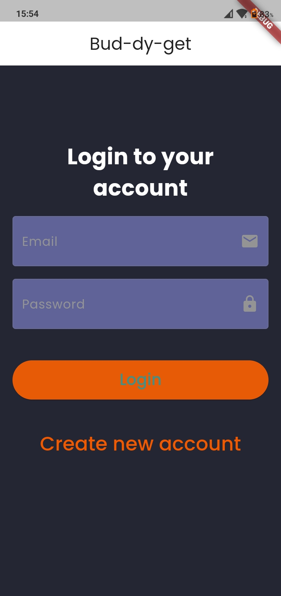
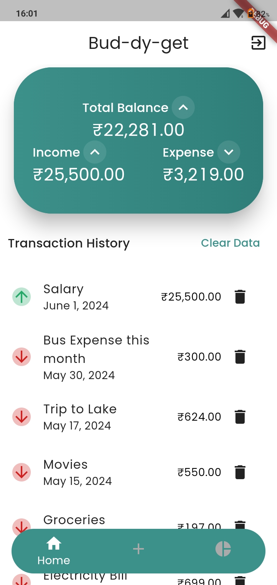
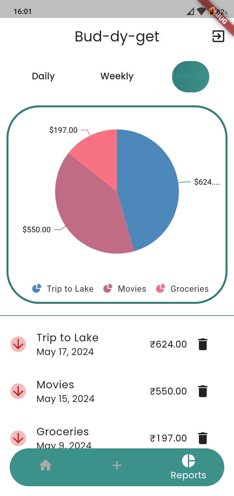
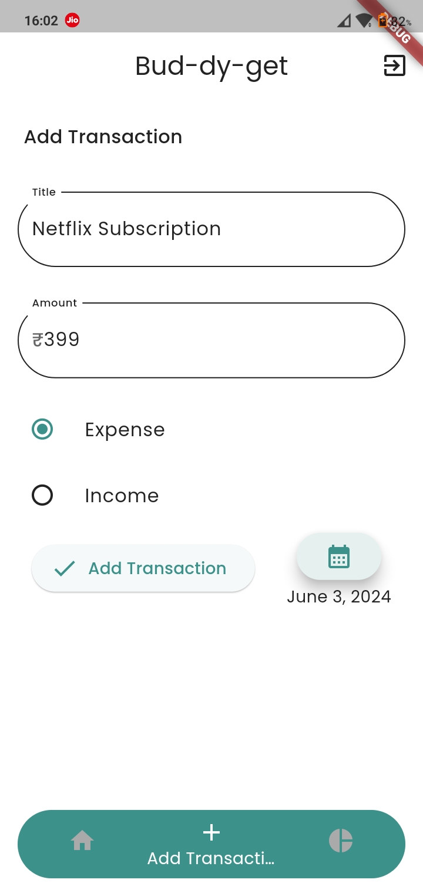
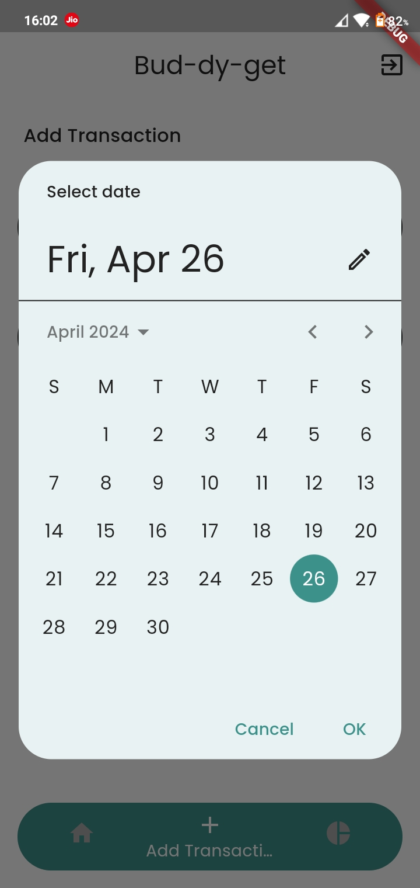

  
  <h1>Bud-dy-get A Material You style Budget Tracker app made using Flutter</h1>

  
Bud-dy-get is an Android Application which can be used for tracking your expenses and budget. This was made for an academic project, which is now open-source! It's features and snapshots are showcased below.
 
  <h1 align="left">📷 Screenshots<h1>
  

    
    
    
    
    
  

## ✨ Features
- Track your Expenses and Budget flawlessly
- Material You Design
- Offline Application
- Once logged in, does not store any expense related data, stores it locally
- No need to login with your original account, create a new dummy one and access the app
- Bar graph view of the `daily`, `monthly`, `yearly` expenses
- Gradient UI
- ...

## 📲 Installation

## ❗ Disclaimer
Any trademark, service mark, trade name, or other intellectual property rights used in this project are owned by the respective owners.
